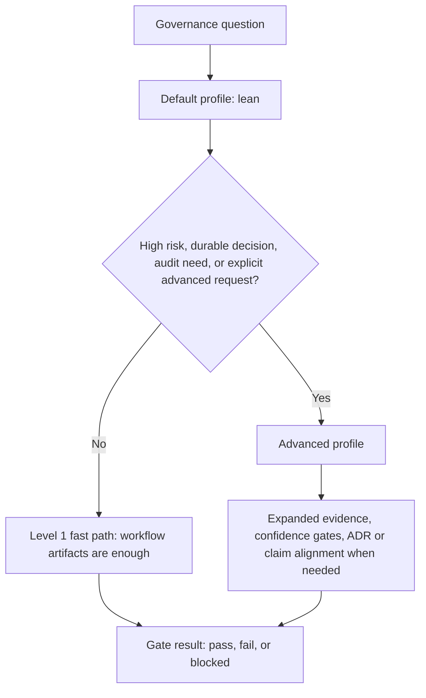
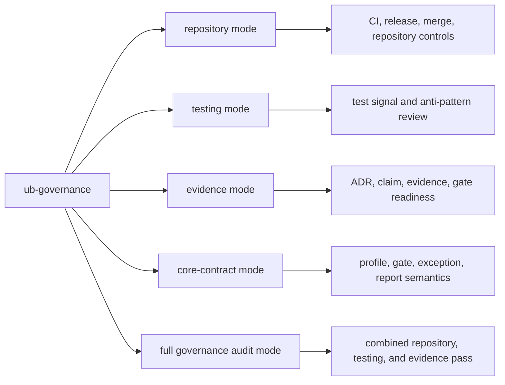

# UB Governance Deep Dive

`ub-governance` decides how much control a change needs. It should stay lean
for ordinary work and escalate only when risk, durability, audit depth, or user
intent requires more structure.

## Profile Model

## Lean Profile

Lean governance is the default. It is appropriate for ordinary workflow-backed
work where deterministic checks, clear validation, and bounded exceptions are
enough.

Lean profile usually means:

- use workflow artifacts as the operational record
- keep exceptions explicit and time-bounded
- run selected checks that match the work
- avoid ADR or claim machinery unless the decision truly needs it

## Advanced Profile

Advanced governance is for higher-risk or more durable decisions. It can add
evidence inventory, confidence gates, ADR alignment, claim verification, and
more explicit release controls.

Escalate when:

- a decision is durable beyond one task or initiative
- a change is repository-wide or high-risk
- auditability matters more than speed
- the user explicitly requests advanced governance with rationale

## Governance Modes

## Gate States

Governance gate outcomes use only:

- `pass`: controls are satisfied
- `fail`: a rule or check failed
- `blocked`: prerequisites are missing or the work cannot progress safely yet

## Bounded Exceptions

An exception is valid only when it is explicit and bounded. It needs an owner,
rationale, creation date, expiry, and follow-up.

## What To Remember

- Lean is the default.
- Advanced is deliberate, not automatic.
- Workflow artifacts are normally enough for Level 1 work.
- ADR and claim machinery are for durable, high-risk, or explicitly governed
  decisions.
