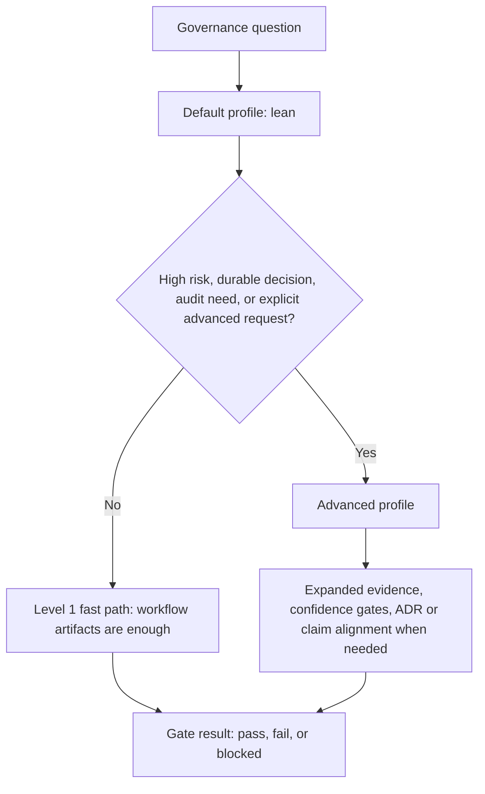
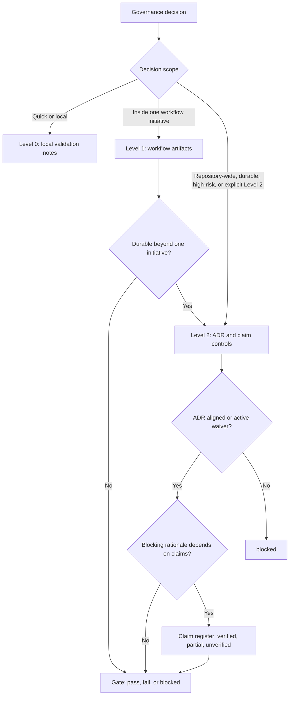
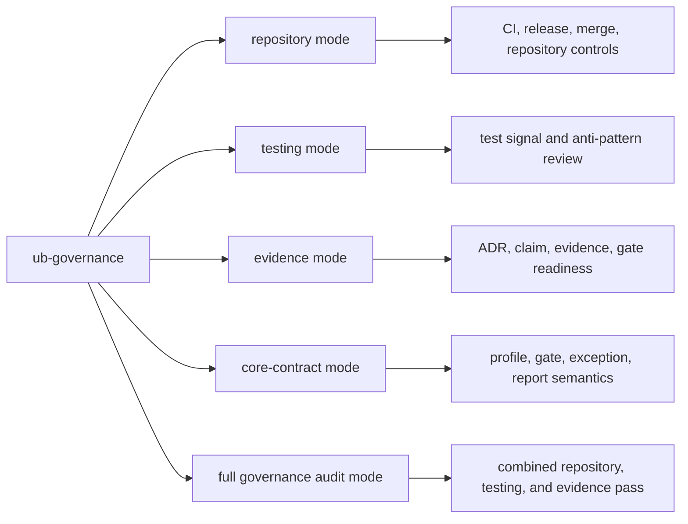
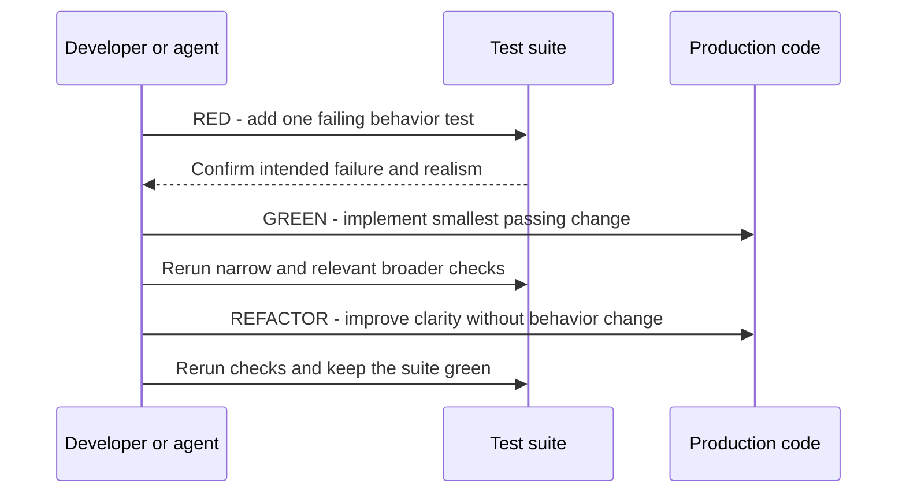

# UB Governance Deep Dive

`ub-governance` decides how much control a change needs. It should stay lean
for ordinary work and escalate only when risk, durability, audit depth, or user
intent requires more structure.

## Profile Model

## Lean Profile

Lean governance is the default. It is appropriate for ordinary workflow-backed
work where deterministic checks, clear validation, and bounded exceptions are
enough.

Lean profile usually means:

- use workflow artifacts as the operational record
- keep exceptions explicit and time-bounded
- run selected checks that match the work
- avoid ADR or claim machinery unless the decision truly needs it

Lean does not mean loose. It means the skill uses the smallest durable record
that can still explain what changed, why it changed, what was validated, and
what remains risky.

## Advanced Profile

Advanced governance is for higher-risk or more durable decisions. It can add
evidence inventory, confidence gates, ADR alignment, claim verification, and
more explicit release controls.

Escalate when:

- a decision is durable beyond one task or initiative
- a change is repository-wide or high-risk
- auditability matters more than speed
- the user explicitly requests advanced governance with rationale

## Decision Memory, ADRs, And Claims

Governance uses a level model for memory:

1. Level 0 or quick edits: local change context and validation notes are
   enough.
2. Level 1 workflow-backed work: PRD, roadmap, sprint docs, closeouts,
   decision logs, sprint evidence, research, and exceptions are the durable
   record.
3. Level 2 or repository-level governance: repository ADRs, ADR registry
   alignment, waivers, claim checks, and higher evidence controls become the
   durable decision surface.

The opinionated part is the restraint. ADRs are important, but they are not the
default answer to every decision. Workflow artifacts are the normal memory for
ordinary initiative work. ADR machinery activates when the decision is durable
outside that workflow, changes shared contracts, touches high-risk paths under
governance, or is explicitly in a Level 2 governance run.

Claims are even narrower. A claim register matters when a blocking gate outcome
depends on claims about compatibility, security, policy conformance, evidence
coverage, or residual risk. A descriptive doc paragraph does not need claim
machinery by default.

## Evidence Model

Evidence is not a pile of screenshots. It is the smallest traceable proof set
that supports the selected governance level.

- Level 1 evidence should stay close to the work: sprint evidence, validation
  output, closeouts, and exception records.
- Level 2 evidence adds repository-level artifacts when the gate depends on
  broader decision memory.
- High-risk paths can require ADR alignment or an active waiver before a pass
  result is credible.
- Expired waivers cannot support confidence or release completion.
- Partial claims can support blocking rationale only with an active bounded
  exception; unverified claims cannot support it.

## Governance Modes

## TDD And Test Quality

Testing mode is one of the most opinionated parts of `ub-governance`. It
prefers behavior-first TDD for behavior-changing work:

For reported defects, governance applies the Prove-It pattern:

1. reproduce the reported defect with a failing regression test
2. confirm the failing test exercises the real defect path
3. implement the smallest fix
4. rerun narrow and broader validation

RED must be realistic. A test is not useful proof if it mocks the behavior
under review, encodes the expected answer in a fake, checks only call counts,
would still pass if the real implementation disappeared, or relies only on a
snapshot, render smoke, coverage number, or "does not throw" assertion.

## DRY, DAMP, And Test Readability

The governance testing stance is deliberately not "deduplicate every line".
In production code, DRY often reduces risk by removing repeated knowledge. In
tests, over-DRY helpers can hide the setup, trigger, and expected outcome that
make a scenario trustworthy.

That is why the testing playbook prefers DAMP tests when readability matters:

- keep each scenario understandable on its own
- allow small duplication when it makes intent visible
- avoid helper abstractions that hide the behavior being proven
- prefer two explicit tests over one parameterized blur when scenarios differ
- keep mocks at real boundaries and pair them with observable outcomes

This is one of the ways Uncle Bob stays opinionated: it values confidence over
surface-level neatness.

## Test-Signal Model

Governance names low-signal tests so reviews can be precise:

- `Type Redundancy`: runtime tests that only restate static type guarantees
- `Interaction Without Outcome`: call assertions without observable behavior
- `Pass-Through Test`: trivial getter or setter pass-through tests
- `Happy-Path-Only Suite`: no meaningful boundary or error representation
- `Internal-Detail Bias`: probable testing of internals over public behavior
- `Local Source Mocking`: replacing local behavior the test claims to prove
- `Uncontracted Test Double`: doubles without a visible boundary reason
- `Mock-Dominant Test`: mostly double setup and call assertions
- `Missing Functional Guard`: risky behavior without a realistic public check
- `Mutation Survivor on Changed Logic`: relevant surviving mutants left
  unreviewed when mutation evidence is already in scope
- `Snapshot/Coverage-Only Proof`: proof that does not actually show behavior

The model is risk-scaled. It does not ban mocks. It rejects fake confidence:
using a double is fine for inaccessible, unsafe, slow, nondeterministic, or
external boundaries; using a double to replace the behavior under review is
not proof.

## Gate States

Governance gate outcomes use only:

- `pass`: controls are satisfied
- `fail`: a rule or check failed
- `blocked`: prerequisites are missing or the work cannot progress safely yet

## Bounded Exceptions

An exception is valid only when it is explicit and bounded. It needs an owner,
rationale, creation date, expiry, and follow-up.

Exceptions are for temporary, owned deviation. They should explain why a rule
cannot be followed now, when the deviation expires, and what will bring the
work back into the normal path.

## What To Remember

- Lean is the default.
- Advanced is deliberate, not automatic.
- Workflow artifacts are normally enough for Level 1 work.
- ADR and claim machinery are for durable, high-risk, or explicitly governed
  decisions.
- Behavior-changing work should usually prove behavior through red, green,
  refactor.
- Good tests can be DAMP when readability and confidence beat aggressive DRY.
- Mocks are allowed at real boundaries; they are not allowed to replace the
  behavior being claimed as proven.
