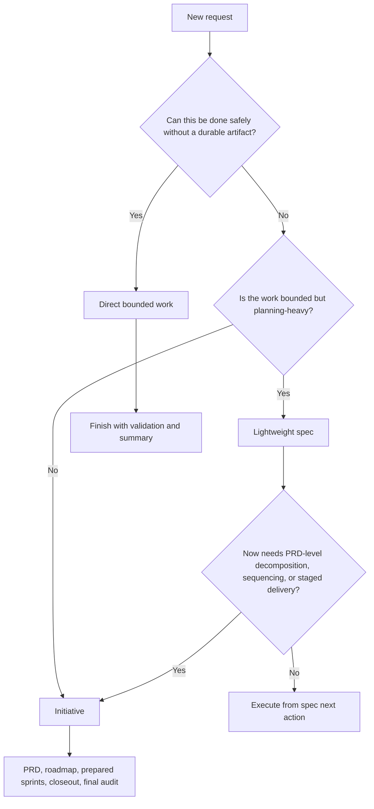
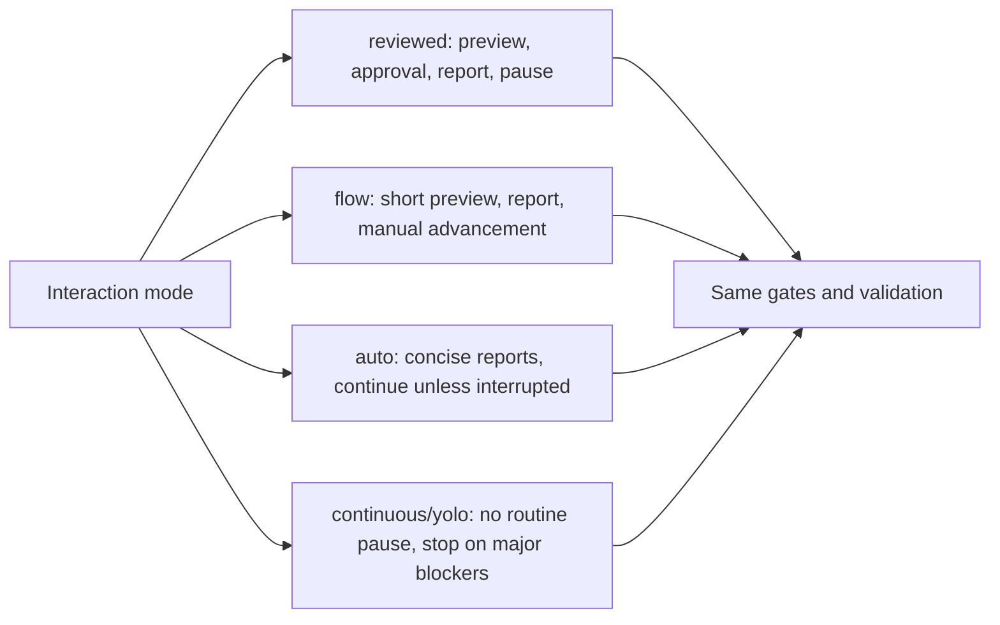
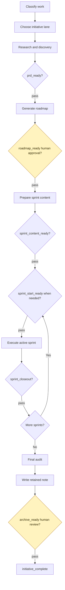

# UB Workflow Deep Dive

`ub-workflow` decides how much structure a piece of work needs. Its core rule
is simple: choose the smallest safe planning lane, then make durable artifacts
the source of truth when the work outgrows chat.

## Lane Choice

## The Three Lanes

`Direct bounded work`
- Best for: small, clear tasks.
- Artifact expectation: none beyond normal validation and reporting.
- Risk: staying direct after the work becomes planning-heavy.

`Lightweight spec`
- Best for: bounded work that needs assumptions, scope, options, validation,
  and a next action recorded.
- Artifact expectation: one `spec.md` in the target project’s workflow root.
- Risk: promoting too late after staged execution is already obvious.

`Initiative`
- Best for: multi-session, risky, cross-cutting, or dependency-heavy work.
- Artifact expectation: PRD, roadmap, prepared sprint docs, closeouts, final
  audit, and retained note.
- Risk: using initiative machinery for work that only needed a lightweight
  spec.

## Interaction Modes

Mode changes how visible and interruptive the workflow feels. It does not
weaken readiness rules.

## Reviewed Mode Matters

In reviewed mode, a request like “start the next sprint” opens the preview. It
does not start implementation. Execution starts only after a later approval
message.

The preview should explain:

1. what repo or project truth says
2. what the agent infers
3. realistic implementation paths
4. the recommended path
5. any questions that change the sprint path
6. the approval boundary

## Initiative Lifecycle

## What To Remember

- Chat history is not the system of record.
- Lightweight specs are a real lane, not a weak initiative.
- Roadmap approval is a human checkpoint.
- Prepared sprint files are not the same thing as started execution.
- Every initiative ends with final audit, retained note, and review before
  archive.
