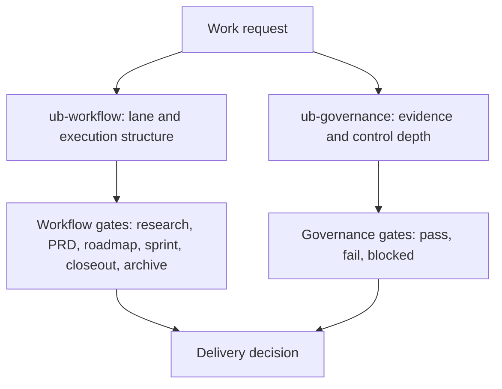
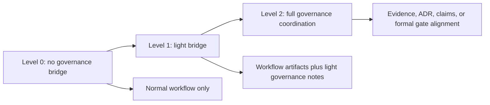

# Workflow And Governance Together

`ub-workflow` and `ub-governance` are adjacent systems. Workflow answers
whether the work package is ready to progress. Governance answers whether the
evidence, risk handling, exception, or decision record is strong enough.

## Separation Of Concerns

## Typical Combinations

`Ordinary planned work`
- `ub-workflow` chooses the lane and artifacts.
- `ub-governance` stays lean or inactive unless a risk question appears.

`High-risk initiative`
- `ub-workflow` owns PRD, roadmap, sprint flow, closeout, and final audit.
- `ub-governance` may add Level 2 evidence, ADR alignment, or claim checks.

`Testing posture review`
- `ub-workflow` may be unnecessary if the task is only review.
- `ub-governance` uses testing mode to assess signal quality.

## Bridge Levels

## Practical Rule

Start with workflow when the problem is delivery shape. Start with governance
when the problem is evidence, test signal, exception handling, or decision
durability. Use both when delivery and control depth are both material.
