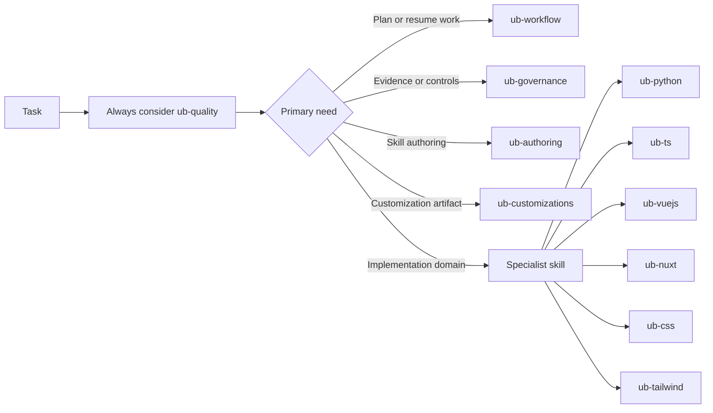

# Routing Model

Routing decides which skill should guide a task. A good route keeps the agent
focused and prevents framework advice from overriding workflow, governance, or
authoring concerns.

## Routing Order

1. Identify whether the task is planning, implementation, review,
   documentation, governance, or customization work.
2. Load the mandatory `ub-quality` baseline.
3. Add the smallest relevant owner skill.
4. Add a language or framework specialist only when the work actually touches
   that domain.
5. Load deeper references only after the owner skill says they matter for the
   active task.

## Examples

- A Python test failure uses `ub-python` with `ub-quality`.
- A Nuxt routing issue uses `ub-nuxt`, and may add `ub-vuejs` only when Vue
  component logic is central.
- A skill-description rewrite uses `ub-authoring`, not a language specialist.
- A PR evidence question uses `ub-governance`, not `ub-workflow`.

## Failure Mode

The common failure is over-routing: loading every related-looking skill. That
adds noise and can turn a simple task into a policy debate. Uncle Bob prefers
the smallest useful skill set, then progressive disclosure inside that skill
when more detail is needed.

For deeper behavior, see [References And Progressive Disclosure](/guide/references-progressive-disclosure).
