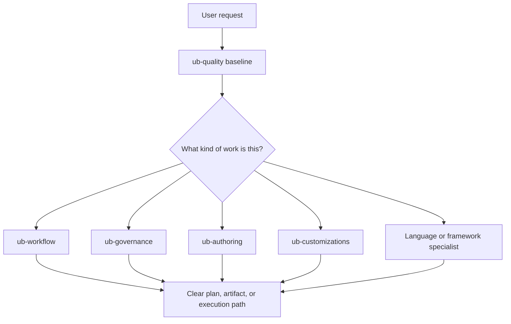

# Skill System

Uncle Bob is a catalog of focused skills. Each skill is an operating contract
that helps an agent handle one kind of work better: planning, governance,
authoring, quality review, customization, or implementation in a specific
technology.

## Mental Model

Think of the system as layers:

1. `ub-quality` is the companion baseline.
2. Routing and control skills shape the work.
3. Implementation specialists apply only when their domain is active.

## What A Skill Changes

A skill changes the agent’s behavior by giving it:

- activation boundaries
- task-specific workflow
- validation expectations
- examples of what to do and what to avoid
- deeper references when the task needs more detail

The skill does not replace project truth. It tells the agent how to inspect the
project and make better choices from the real context in front of it.

## Common Combinations

- `ub-quality` + `ub-workflow`: planning or delivery work.
- `ub-quality` + `ub-governance`: risk, evidence, or testing posture.
- `ub-authoring` + `ub-customizations`: building reusable agent guidance.
- `ub-ts` + `ub-vuejs`: Vue implementation with TypeScript contracts.
- `ub-nuxt` + `ub-tailwind`: Nuxt app structure plus Tailwind integration.
